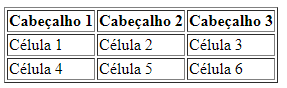
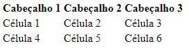
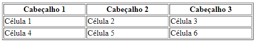
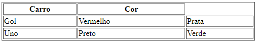
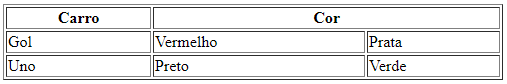
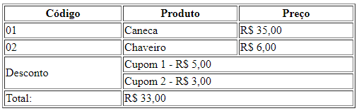
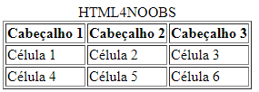
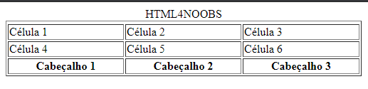

<h1 align = "center"> Tabelas </h1>

## O que é uma tabela?

Tabela é o conjunto de linhas e colunas. Uma tabela é utilizada para organizar dados.

## Estrutura de uma tabela em HTML

Para criar uma tabela no HTML é necessário utilizar a tag `<table>` e mais algumas estruturas que são as tags `<tr>`, `<th>` , `<td>` , `<thead>`,`<tbody>` e `<tfoot>`.

## Tags Básicas
- `<table>`: Define uma estrutura de tabela.
- `<tr>`: Define uma linha para tabela.
- `<th>`: Define o cabeçalho da tabela.
- `<td>`: Define os dados/células na tabela.  

**Obs: Todas as tags possui fechamento.**

_Sintaxe_
```html
<!DOCTYPE html>

<html>

    <head>
        <title>Minha primeira tabela</title>
        <meta charset="UTF-8">
    </head>

    <body>
        <table border="1">
            <tr> <!-- Linha que contêm os cabeçalhos -->
                <th>Cabeçalho 1</th>
                <th>Cabeçalho 2</th>
                <th>Cabeçalho 3</th>
            </tr>
            <tr> <!-- Linha que contêm os dados/células -->
                <td>Célula 1</td>
                <td>Célula 2</td>
                <td>Célula 3</td>
            </tr>
            <tr> <!-- Linha que contêm os dados/células -->
                <td>Célula 4</td>
                <td>Célula 5</td>
                <td>Célula 6</td>
            </tr>
        </table>
    </body>
</html>
```

Resultado:



## Definir bordas 

Para ter uma visualização melhor da tabela é necessário definir uma borda. Para definir uma borda, use o `border="número"` dentro da tag `<table>`. 

_Sintaxe_
```html
 <table border=" ">
```

Onde:
- Número: Recebe um valor inteiro.

Se a borda da tabela não for definida, teremos o seguinte resultado:



Adicionando a borda, teremos o seguinte resultado:


**Obs: Se o tamanho da borda não for definido, por padrão ele começará com 1.**

## Definir tamanho da tabela 

Para definir o tamanho da tabela, use o `width="tamanho"` dentro da tag `<table>`. 

Onde:
- Tamanho: Recebe o valor(px ou porcentagem) para definir o tamanho da tabela.

_Sintaxe_
```html
<!DOCTYPE html>

<html>

    <head>
        <title>Minha primeira tabela</title>
        <meta charset="UTF-8">
    </head>

    <body>
        <table border="1" width="500">
            <tr> 
                <th>Cabeçalho 1</th>
                <th>Cabeçalho 2</th>
                <th>Cabeçalho 3</th>
            </tr>
            <tr> 
                <td>Célula 1</td>
                <td>Célula 2</td>
                <td>Célula 3</td>
            </tr>
            <tr>
                <td>Célula 4</td>
                <td>Célula 5</td>
                <td>Célula 6</td>
            </tr>
        </table>
    </body>
</html>
```

Resultado:



**Obs: Para definir o tamanho em porcentagem é necessário adicionar o símbolo % após o valor.**

## Expansão de coluna

Quando queremos que uma célula ocupe mais de uma coluna, nós utilizamos o `colspan="número"`. Podemos utilizar o `colspan="número"` dentro das tags `<th>` e `<td>`.

Onde:
- Número: Recebe o número de colunas que uma célula deve se expandir.

Exemplo de tabela sem `colspan`:

_Sintaxe_
```html
<!DOCTYPE html>

<html>

    <head>
        <title>Minha primeira tabela</title>
        <meta charset="UTF-8">
    </head>

    <body>
        <table border="1" width="500">
            <tr>
                <th>Carro</th>
                <th>Cor</th>
            </tr>
            <tr>
                <td>Gol</td>
                <td>Vermelho</td>
                <td>Prata</td>
            </tr>
            <tr>
                <td>Uno</td>
                <td>Preto</td>
                <td>Verde</td>
            </tr>
        </table>
    </body>
</html>
```

Resultado:



Exemplo de tabela com `colspan`:

_Sintaxe_
```html
<!DOCTYPE html>

<html>

    <head>
        <title>Minha primeira tabela</title>
        <meta charset="UTF-8">
    </head>

    <body>
        <table border="1" width="500">
            <tr>
                <th>Carro</th>
                <th colspan="2">Cor</th>
            </tr>
            <tr>
                <td>Gol</td>
                <td>Vermelho</td>
                <td>Prata</td>
            </tr>
            <tr>
                <td>Uno</td>
                <td>Preto</td>
                <td>Verde</td>
            </tr>
        </table>
    </body>
</html>
```

Resultado:



## Expansão de linha

Quando queremos que uma célula ocupe mais de uma linha, nós utilizamos o `rowspan="número"`. Devemos utilizar o `rowspan="número"` dentro da tag `<td>`.

Onde:
- Número: Recebe o número de linhas que uma célula deve se expandir.

Exemplo de tabela sem `rowspan`:

_Sintaxe_
```html
<!DOCTYPE html>

<html>

    <head>
        <title>Minha primeira tabela</title>
        <meta charset="UTF-8">
    </head>

    <body>
        <table border="1" width="500">
            <tr>
                <th>Nome</th>
                <td>Pedro</td>
            </tr>
            <tr>
                <th>Stacks</th>
                <td>HTML5</td>
            </tr>
            <tr>
                <th>Stacks</th>
                <td>CSS3</td>
            </tr>
            <tr>
                <th>Stacks</th>
                <td>Javascript</td>
            </tr>
        </table>
    </body>
</html>
```

Resultado:


Exemplo de tabela com `rowspan`:

_Sintaxe_
```html
<!DOCTYPE html>

<html>

    <head>
        <title>Minha primeira tabela</title>
        <meta charset="UTF-8">
    </head>

    <body>
        <table border="1" width="500">
            <tr>
                <th>Nome</th>
                <td>Pedro</td>
            </tr>
            <tr>
                <th rowspan="3">Stacks</th>
                <td>HTML5</td>
            </tr>
            <tr>
                <td>CSS3</td>
            </tr>
            <tr>
                <td>Javascript</td>
            </tr>
        </table>
    </body>
</html>
```

Resultado:



## Legenda 

Para adicionar legenda a uma tabela é preciso usar a tag `<caption>` dentro da estrutura `<table>`.

Exemplo:

_Sintaxe_
```html
<!DOCTYPE html>

<html>

    <head>
        <title>Minha primeira tabela</title>
        <meta charset="UTF-8">
    </head>

    <body>
        <table border="1" width="500">
            <caption>HTML4NOOBS</caption>
            <tr> 
                <th>Cabeçalho 1</th>
                <th>Cabeçalho 2</th>
                <th>Cabeçalho 3</th>
            </tr>
            <tr>
                <td>Célula 1</td>
                <td>Célula 2</td>
                <td>Célula 3</td>
            </tr>
            <tr> 
                <td>Célula 4</td>
                <td>Célula 5</td>
                <td>Célula 6</td>
            </tr>
        </table>
    </body>
</html>
```

Resultado:



## Tags Avançadas, voltadas para o posicionamento dos elementos.
- `<thead>`: Define as linhas que irão fazer parte do cabeçalho.
- `<tbody>`: Define as linhas que irão fazer parte do corpo.
- `<tfoot>`: Define as linhas que irão fazer parte do cabeçalho.

Estas tags deveram está antes d

Com essas tags, a tabela torna-se um pouco mais manipulável. Um exemplo disto é caso eu queria destacar o resultado de uma pesquisa, posso por exemplo aplicar um estilo apenas para o rodapé.

Também, ajudam na questão semântica de seu código e garante que as tabelas vão ser exibidas de forma correta:

Idealmente suas tabelas deveriam seguir, este padrão:
## Tabelas com `<theader>, <tbody> e <tfoot>`

```html
    <table border="1" width="500">
        <thead>
            <tr> 
                <th>Cabeçalho 1</th>
                <th>Cabeçalho 2</th>
                <th>Cabeçalho 3</th>
            </tr>
        </thead>
        <tbody>
            <tr>
                <caption>HTML4NOOBS</caption>
                <td>Célula 1</td>
                <td>Célula 2</td>
                <td>Célula 3</td>
            </tr>
        </tbody>
        <tfoot>
            <tr> 
                <td>Célula 4</td>
                <td>Célula 5</td>
                <td>Célula 6</td>
            </tr>
        </tfoot>
    </table>
```


Você deve ter percebido, que não houve diferença entre este e o exemplo anterior. Dentro de um cenário ideal, realmente este deve ser o resultado.

Mas avançando um pouco, poderiamos fazer algo como:

## Rodapé ou cabeçalho ?

```html
    <table border="1" width="500">
        <tfoot>
            <tr> 
                <th>Cabeçalho 1</th>
                <th>Cabeçalho 2</th>
                <th>Cabeçalho 3</th>
            </tr>
        </tfoot>
        <tr>
            <caption>HTML4NOOBS</caption>
            <td>Célula 1</td>
            <td>Célula 2</td>
            <td>Célula 3</td>
        </tr>
        <tr> 
            <td>Célula 4</td>
            <td>Célula 5</td>
            <td>Célula 6</td>
        </tr>
    </table>
```

Resultado:  


Perceba neste exemplo, não segue necessáriamente a ordem descrita no HTML, o rodapé exibido foi descrito nas primeiras linhas do código e não nas últimas como é tradicionalmente. A Tag `<tfoot>`, força o elemento a se encaixar-se no final da tabela.

A mesma lógica é valida para as tags `<thead>`  e `<tbody>` que força o elemento a se encaixar-se no inicio e meio da tabela respesctivamente.

Desta forma podemos ganhar mais controle sobre o posicionamento dos elementos tabulares.


----

[Tags de Formulário](/contents/10.Formulario.md) <= Anterior | [Início](/README.MD) | Próximo => [Tags de Estilo e Script](/contents/12.Estilo.md)

