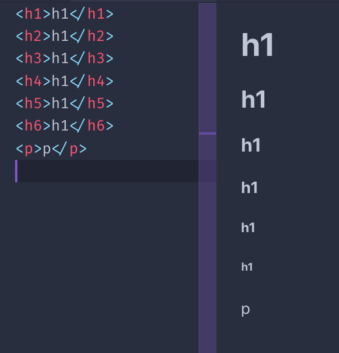
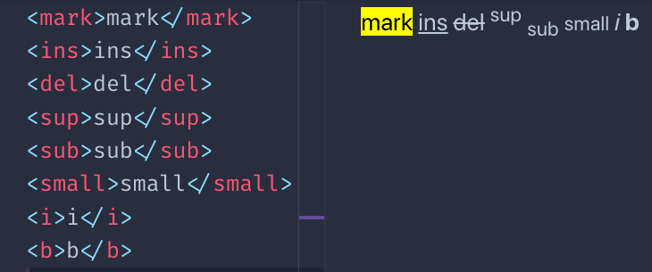

<h1 align = "center"> Tag de Texto </H1>

## Tag **`P`**

Para iniciar nossa jornada iremos comecar pela tag `P`, que tem como funcionalidade criar um parágrafo.

_Sintaxe_
 ```html
<p> Texto </p>
 ```

Ele é um elemento em bloco.  

Elementos de bloco: Utilizam todo o espaço disponível e começam uma nova linha no documento.  

Dentro dele, podemos adicionar qualquer elemento embutido que quisermos, como `SPAN` ou `A`. (Vocês verão nos próximos tópicos.)

## Tag **`SPAN`**

Esta é uma tag inline que pode ser usada para criar uma seção em um parágrafo que pode ser direcionada usando CSS.  

Ex: 

```html
<p>Uma parte do texto <span> e aqui outra parte </span></p>
```

## Tag **`BR`**

Esta tag representa uma quebra de linha. É um elemento embutido e não precisa de uma tag de fechamento.

Nós o usamos para criar uma nova linha dentro de uma tag <b>P</b>, sem criar um novo parágrafo.

>Dica: Em comparacão com a criação de um novo parágrafo, não adiciona espaçamento adicinal!

Ex:

```html
<p>Um texto<br>Uma nova linha</p>
```

## Tag de títulos **`<h1>–<h6>`**

O html possui 6 tipos de tags de títulos. De mais importante para o menos importante,temos: **H1,H2,H3,H4,H5,H6.**

Normalmente sempre uma página terá um **H1** que será o título da página.

Abaixo vocês verão um exemplo do uso das tags `heading`:



>Todos os títulos são elementos de bloco.

## Tag **`STRONG`**

Esta tag é usada para marcar o texto dentro dela como forte. Isso é muito importante, não é uma dica visual, mas uma dica semântica. Dependendo do meio usado, sua interpretação pode variar.  

Os navegadores, por padrão, deixam o texto dessa tag em `negrito`.

## Tag **`EM`**

Esta tag é usada para marcar o texto dentro dela como enfatizado. Os navegadores, por padrão, deixam o texto em `Italico`.

## Outras tags de texto

Existem várias tags com fins de apresentação:

> A tag `mark` 

> A tag `ins` 

> A tag `del` 

> A tag `sup` 

> A tag `sub` 

> A tag `small` 

> A tag `i` 

> A tag `b`

Este é um exemplo de renderização visual deles, que é aplicado por padrão pelos navegadores:



Você pode acabar se perguntando porque `b` é diferente de `strong`? E como `i` é diferente de `em`?

 A diferença está no significado semântico. Enquanto `b` e `i` são uma dica direta ao navegador para deixar um trecho de texto em negrito ou itálico `strong` e `em` dar ao texto um significado especial, e cabe ao navegador definir o estilo, que é exatamente o mesmo que `b` e `i`, por padrão. Embora você possa mudar isso usando CSS.

 ---

 [Tags Estruturais](/contents/3.Estruturais.md) <= Anterior | [Início](/README.MD) | Próximo => [Atributos](/contents/5.Atributos.md)
