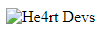
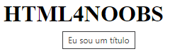
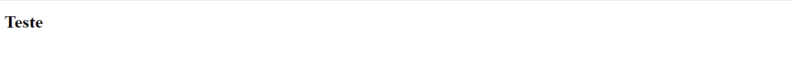
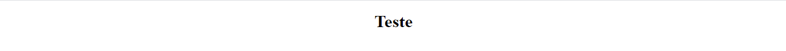
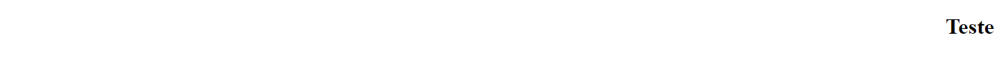

<h1 align = "center"> Atributos </h1> 

## Para que serve os atributos? 

Os atributos servem para definir uma propriedade de um elemento HTML. Os atributos são sempre definidos dentro da tag de abertura.

- Os atributos são definidos após o nome do elemento.
- Os atributos são formados pelo nome, um sinal de igual e valor.
- O valor pode ficar dentro de aspas duplas **""** ou aspas simples **''**.

_Sintaxe_
```html
<body bgcolor="red">
    <p> Lorem Ipsum </p>
</body>
```

Onde:

- `body`: É o elemento que estamos inserindo o atributo.
- `bgcolor`: É o nome do atributo.
- `red`: É o valor do atributo

## Tipos de atributos 

### Atributo id

O atributo `id` é um atributo global utilizado para definir um identificador exclusivo. Esse identifcador deve ser único em todo a página. O `id` é utilizado para identificar o elemento ao navegar por âncoras utilizando scripts ou para estilização.

_Sintaxe_
```html
<body>
    <p id="contato"> Entre em contato </p>
</body>
```

### Atributo class

O atributo `class` é um atributo global utilizado para definir uma lista de classes de um elemento. Diferente do `id`, as classes podem ser repetidas na página. O `class` é bastante utilizado para definir o css de um grupo de elementos.

_Sintaxe_
```html
<body>
    <p class="paragrafo"> Entre em contato </p>
    <p class="paragrafo"> Entre em contato </p>
</body>
```

### Atributo style 

O atributo `style` é um atributo global utilizado para definir estilos a um elemento, como tamanho, fonte e muito mais.

_Sintaxe_
```html
<body>
    <p style="font-size: 12px; color: aquamarine;">Lorem Ipsum</p>
</body>
```

### Atributo href 

#### URL

O atributo `href` pode ser utilizado para indicar a URL da página para a qual o link irá redirecionar.

_Sintaxe_
```html
<a href="https://www.google.com/">Goole</a>
```
Onde:

- `a`: É o elemento que estamos inserindo o atributo.
- `href`: É o nome do atributo.
- `link`: Endereço para qual será redirecionado ao clicar no link.

#### Âncora

Com o href também é possível redirecionar a um elemento âncora, mas antes é necessário definir uma id para o elemento.

_Sintaxe_
```html
<a href="#sobre">Sobre a empresa</a>
```
Onde:

- `a`: É o elemento que estamos inserindo o atributo.
- `href`: É o nome do atributo.
- `#sobre`: Redirecionará ao elemento âncora sobre.

#### Página

Também é possível redirecionar a uma página.

_Sintaxe_
```html
<a href="./paginas/contato.html">Contato</a>
```
Onde:

- `a`: É o elemento que estamos inserindo o atributo.
- `href`: É o nome do atributo.
- `#sobre`: Redirecionará a página contato.html dentro da pasta paginas.

### Atributo src 

O atributo `src` é utilizado para inserir uma imagem em uma página HTML. Para inserir uma imagem você pode enviar a URL de duas formas:

#### URL Absoluto

URL Absoluto é composto pelo protocolo, domínio e o caminho no servidor. Com URL Absoluto você pode passar o caminho de uma imagem que está hospedada em outro site.

_Sintaxe_
```html

```
Onde:

- `a`: É o elemento que estamos inserindo o atributo.
- `src`: É o nome do atributo.
- `link`: Caminho no qual a imagem está hospedada.


#### URL Relativo

Com URL Relativo você pode passar o caminho de uma imagem que está hospedada no site. 
- URL sem barra: Será utilizado o domínio e o caminho da página atual.

_Sintaxe_
```html

```

- URL com barra: Será relativo ao domínio.

_Sintaxe_
```html

```

### Atributo width e height 

O atributo `width` e o atributo `height` é utilizado na tag `img`. Onde o `width` indica a largura e o `height` indica a altura da imagem.

_Sintaxe_
```html

```

Também é possível passar o valor como porcentagem como no exemplo abaixo: 

_Sintaxe_
```html

```
### Atributo alt 

O atributo `alt` é utilizado na tag `img`. Com o atributo `alt` você pode especificar um texto alternativo para uma imagem, caso a imagem não seja exibida por algum motivo.

_Sintaxe_
```html

```

Resultado:



### Atributo lang 

O atributo `lang` é utilizado na tag `html`. Com o atributo `lang` você declara o idioma da sua página web, auxiliando mecanismos de pesquisa e navegadores.

_Sintaxe_
```html
<!DOCTYPE html>
<html lang="pt">
    <head>
        ...
    </head>
    <body>
        ...
    </body>
</html>
```
O exemplo a cima declara o português como o idioma.

_Sintaxe_
```html
<!DOCTYPE html>
<html lang="pt-BR">
    <head>
        ...
    </head>
    <body>
        ...
    </body>
</html>
```
O exemplo a cima declara o português como o idioma e o Brasil como o país.

### Atributo title 

O atributo `title` exibi informações de orientação relacionado ao elemento que ele pertence. O valor será exibido ao passar o mouse sobre o elemento.

_Sintaxe_
```html
 <h1 title="Eu sou um título">HTML4NOOBS</h1>
```

Resultado:



### Atributo hidden

O atributo `hidden` é utilizado para ocultar elementos no qual ele foi definido, indicando que o elemento não é importante. Por ser um atributo global, o `hidden` pode ser utilizado em qualquer elemento HTML.  

_Sintaxe_
```html
 <h1 hidden>HTML4NOOBS</h1>
```

### Atributo align

O atributo `align` é utilizado para alinhar elementos da sua página. O `align` pode:

- Alinhar a esquerda
_Sintaxe_
```html
 <h1 align="left">HTML4NOOBS</h1>
```


- Centralizar
_Sintaxe_
```html
 <h1 align="center">HTML4NOOBS</h1>
```


- Alinhar a direita
_Sintaxe_
```html
 <h1 align="right">HTML4NOOBS</h1>
```


**Obs: Por padrão os elementos serão alinhados a esquerda.**

---

[Tags de Texto](/contents/4.Texto.md) <= Anterior | [Início](/README.MD) | Próximo => [Comentários](/contents/6.Comentarios.md)