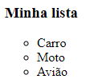
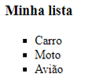
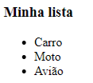
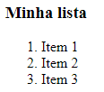
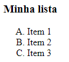
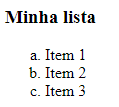
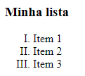
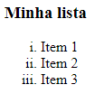
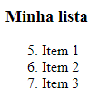
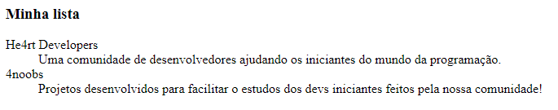

<h1 align = "Center"> Listas </h1>

No HTML nós temos três tipos de listas, sendo elas `listas não ordenadas`, `listas ordenadas` e `listas de descrição`.

## Listas não ordenadas 

Para criar uma lista não ordenada basta utilizar a tag `<ul>` e adicionar a tag `<li>` para definir os itens da lista.

_Sintaxe_
```html
<!DOCTYPE html>

<html>

    <head>
        <title>Minha lista</title>
    </head>

    <body>
        <h3>Minha lista</h3>
        <ul>
            <li>Carro</li>
            <li>Moto</li>
            <li>Avião</li>
        </ul>
    </body>

</html>
```
Resultado:



### Tipos de marcadores nas listas não ordenadas

Por padrão os itens das listas não ordenadas serão marcados por círculos pretos, mas nós podemos mudar utilizando o `type="valor"` dentro da tag `<ul>`.

_Sintaxe_
```html
<ul type="valor">
```

Onde: 
- Valor: Tipo de marcador que você queira utilizar.

Os valores podem ter três padrões:

- type="circle": Círculo não preenchido.


- type="square": Quadrado preto.



- type="disc": Círculo preenchido.



## Listas ordenadas 

Para criar uma lista Ordenada basta utilizar a tag `<ol>` e adicionar a tag `<li>` para definir os itens da lista.

_Sintaxe_
```html
<!DOCTYPE html>

<html>

    <head>
        <title>Minha lista</title>
    </head>

    <body>
        <h3>Minha lista</h3>
        <ol>
            <li>Item 1</li>
            <li>Item 2</li>
            <li>Item 3</li>
        </ol>
    </body>

</html>
```
Resultado:



### Tipos de marcadores nas listas ordenadas

Por padrão os itens das listas ordenadas serão marcados por números, mas nós podemos mudar utilizando o `type="valor"` dentro da tag `<ol>`.

_Sintaxe_
```html
<ol type="valor">
```

Onde: 
- Valor: Tipo de marcador que você queira utilizar.

Os valores podem ter cinco padrões:

- type="1": Valores inteiros 1,2,3...


- type="A": Alfabeto em maiúsculas A,B,C...



- type="a": Alfabeto em minúsculas a,b,c...



- type="I": Algarismos Romanos em maiúsculo I,II,III...



- type="i": Algarismos Romanos em minúsculO i,ii,iii...



### Alterar valor inicial da numeração

A lista ordenada por padrão começa com 1, mas é possível alterar utilizando o atributo `start="valor"` dentro da tag `<ol>`.

_Sintaxe_
```html
<ol start="valor">
```
Onde: 
- Valor: Valor que você gostaria de iniciar a lista.

Exemplo:
_Sintaxe_
```html
<!DOCTYPE html>

<html>

    <head>
        <title>Minha lista</title>
    </head>

    <body>
        <h3>Minha lista</h3>
        <ol start="5">
            <li>Item 1</li>
            <li>Item 2</li>
            <li>Item 3</li>
        </ol>
    </body>
</html>
``` 

Resultado:



## Listas de descrição 

A lista de descrição é definida através da tag `<dl>`, a tag `<dt>` define o nome que será descrito e a tag `<dd>` é a descrição.

_Sintaxe_
```html
<!DOCTYPE html>

<html>

    <head>
        <title>Minha lista</title>
    </head>

    <body>
        <h3>Minha lista</h3>
        <dl>
            <dt>He4rt Developers</dt>
            <dd>Uma comunidade de desenvolvedores ajudando os iniciantes do mundo da programação.</dd>
            <dt>4noobs</dt>
            <dd>Projetos desenvolvidos para facilitar o estudos dos devs iniciantes feitos pela nossa comunidade!</dd>
        </dl>
    </body>
</html>
``` 

Resultado:



----

[Tags de Link](/contents/7.Link.md) <= Anterior | [Início](/README.MD) | Proximo => [Tags de Multimídia](/contents/9.Multimidia.md)
